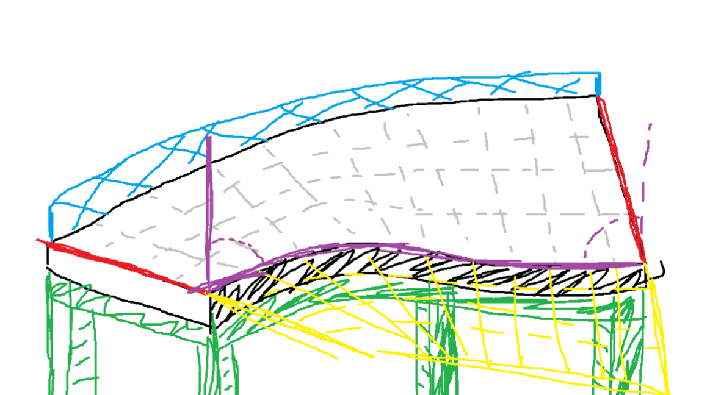
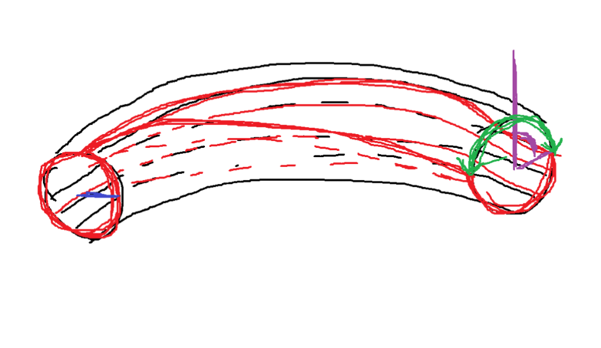
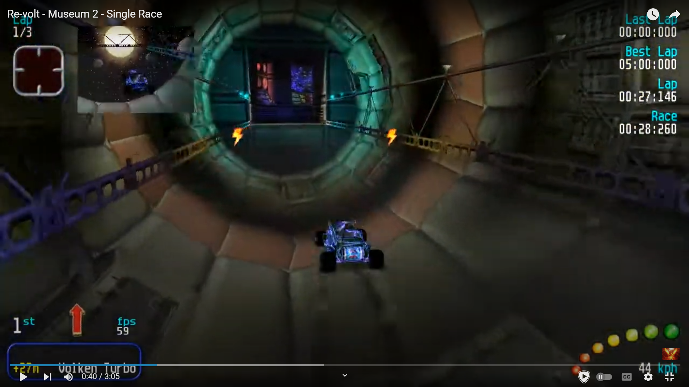

# Editor Revamp

## Prefabs

- __Red__: Road Profile / Connection Points
  - direction
  - slope (also in __Purple__)
  - tilt 
  - position
  - width
  - profile
    - straight
    - sausage
    - bowl
    - custom
- __Green__: Support Structure
  - type
    - solid
    - scaffold
    - pillars
    - none
  - material (texture)
- __Blue__: Guard Rails / Wall
  - type
	- guard rail
	- wall
	- fence
	- none 
- __Yellow__: Runoff Area (extension)
  - on/off (each side)
  - size
  - profile
  - surface
- __Gray__: Surface
  - side smoothing (on/off)
  - type
    - road
    - dirt
    - grass
    - booster
    - _sand_
    - _ice_
    - _mud_
    - _glass_
- __Not shown__: Color

## Pipes

- __Red__: Profile
  - direction
  - slope 
  - tilt (also in __Purple__)
  - position
  - profile / openness (in degrees) (also in __Green__)
  - radius (also in __Blue__)
- __Black__: Surface
  - side smoothing (on/off)
  - type
    - same as before
- __Not shown__: inside/outside pipe

## functional

- start line
  - current
  - circular
  - rally type
- checkpoints
  - current 
  - current, but only top half 
  - similar to finish line
  - rally type

## Scenery

- Terraformable heightmap
- colorable texture for road
- Select surface type
- custom gradient color
- wheater
  - fog
  - rain / snow / sandstorm
  - wind
  - time of day 

## Deco

- Vegetation
  - trees
  - bushes
  - hedges
- Props
  - buildings (in parts)
  - signs
  - lights
  - fences
  - barriers
  - poles
  - traffic cones
  - barrels
  - crates
  - vehicles
- entities (static / animated)
  - animals
  - people
  - robots
  - monsters
- Structural
  - I-beams
  - Cables
  - Pipes
- Special
  - billboards (led screens) 

## Misc

- fluid containers
  - type
    - water
    - lava
    - acid
    - oil
    - mud
  - shape (prolly simple cuboid, maybe cillinder)
- waterfalls
- particle emitters
  - type
	- smoke
	- fire
	- sparks
	- dust 
- maybe sound emitters
  - type
	- music
	- ambient
	- sfx
- simple shapes with custom textures

## notes from other games

- glass bridges (glass surface, guard rails, no support, water under)

- bridge inside pipe

.png>)
- animals 

.png>)
- wide/narrow roads

.png>)
- road with guard rails, vehicle props, simple shapes in sky

.png>)
- briddge inside pipe + lava + poles

.png>)
- large pipe as cave, road with runoff, simple pipes/shapes as support

.png>)
- support on side, insie pipe as tunnel, waterfall, etc.

.png>)
- pillars, simple shapes, road with walls

.png>)
- road with fence, pillars, simple shapes, lava
  
.png>)
- terraformed surface, wallride should be possible with prefab

.png>)
- pipe as tunnel, road with walls, shapes for crystals

.png>)
- tunnel etc + waterfall + water